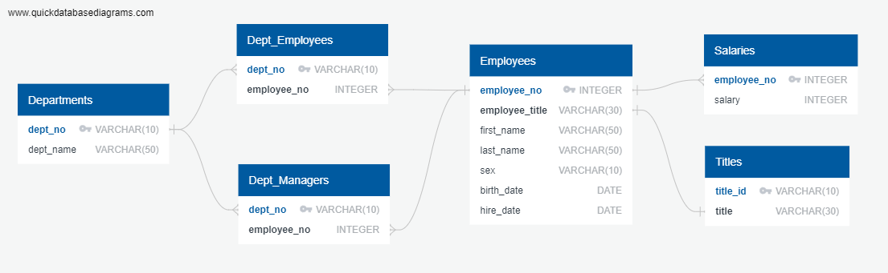

# Data Modeling, Data Engineering and Data Analysis using SQL (PostgreSQL)

This challenge is completed as requirement of Data Analytics Boot Camp at University of Toronto.

It is a research project about the employees at a fictional company named Pewlett Hackard. These employees worked at the company between 1980 and 1990s. There are six CSV file (in the Resources folder in the repository) provided containing data about employees' names, id, department name and id, salary, birth date, gender and hire date.

The project reequirement is to design tables using PostgreSQL to hold data from the CSVs (data modeling), import the CSV files into the SQL database (data engineering), and then answer some analysis questions (data analysis). 

## Data Modeling

The first task involves inspecting the CSV files, and then sketching an Entity Relationship Diagram (ERD) of the tables. I have used [QuickDBD] (https://www.quickdatabasediagrams.com/) to sketch the ERD. The ERD is saved as image in the ERD folder within Employees_SQL, as well as the code for creating the image is saved in SQL and text format which shows the relationships and keys. 

## Data Engineering
