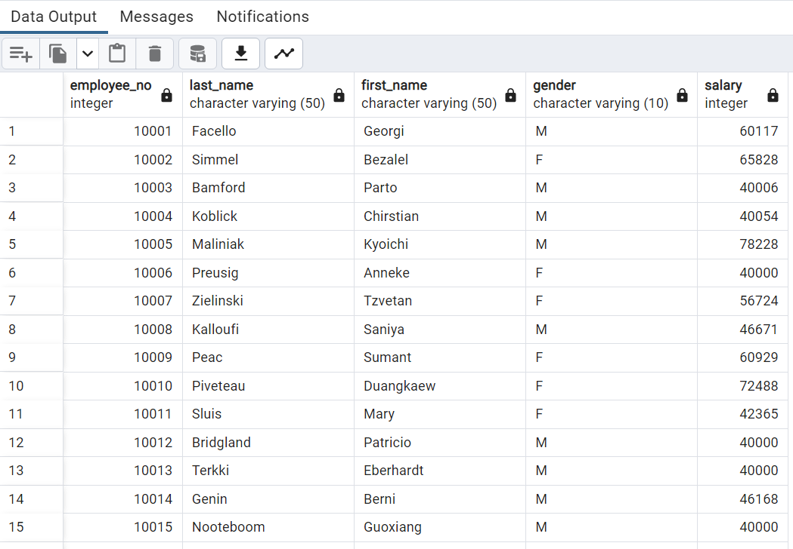
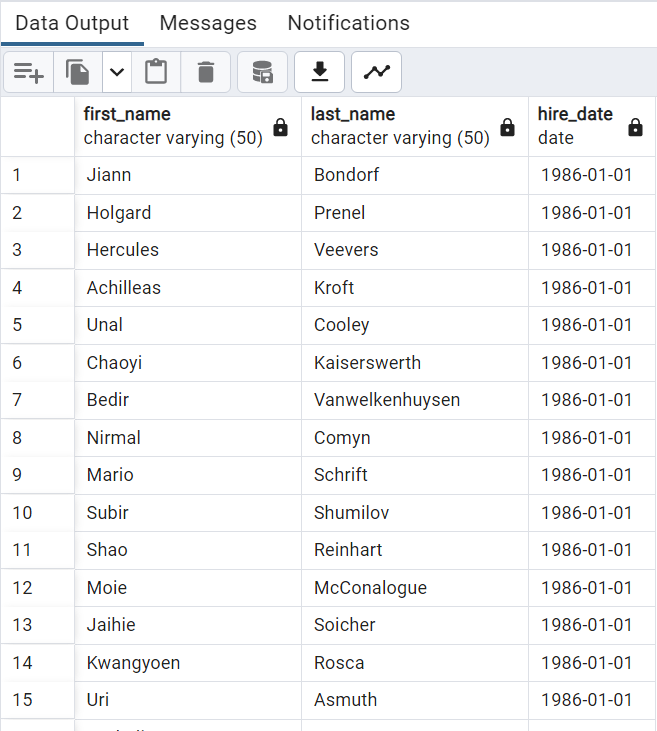
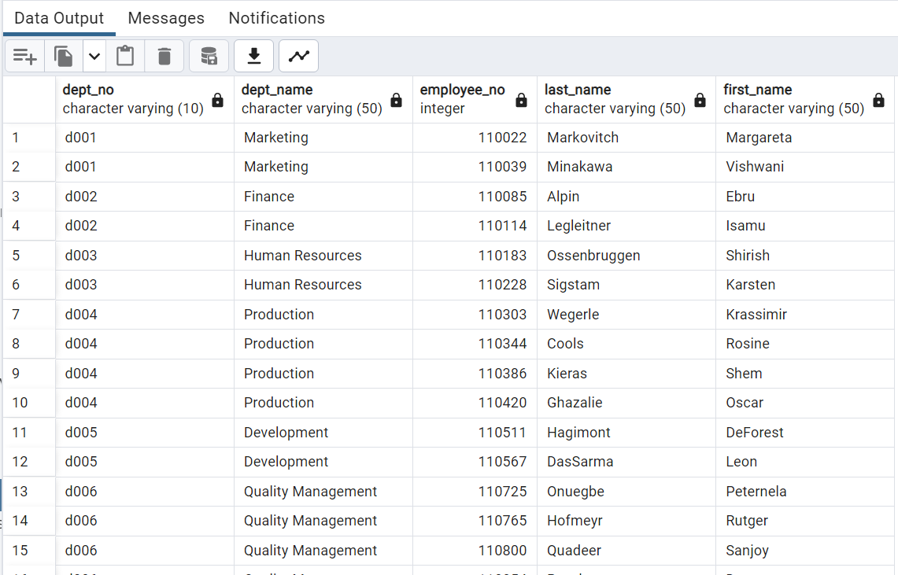
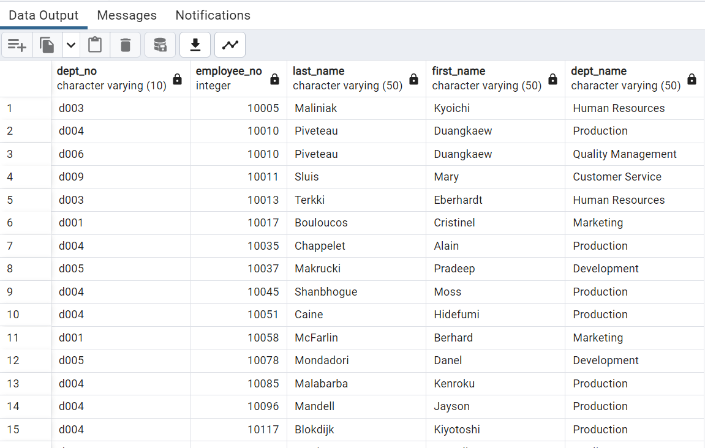

# Data Modeling, Data Engineering and Data Analysis using SQL (PostgreSQL)

This challenge is completed as requirement of Data Analytics Boot Camp at University of Toronto.

It is a research project about the employees at a fictional company named Pewlett Hackard. These employees worked at the company between 1980 and 1990s. There are six CSV file (in the Resources folder in the repository) provided containing data about employees' names, id, department name and id, salary, birth date, gender and hire date.

The project reequirement is to design tables using PostgreSQL to hold data from the CSVs (data modeling), import the CSV files into the SQL database (data engineering), and then answer some analysis questions (data analysis). 

## Data Modeling

The first task involves inspecting the CSV files, and then sketching an Entity Relationship Diagram (ERD) of the tables. I have used [QuickDBD](https://www.quickdatabasediagrams.com/) to sketch the ERD. The ERD is saved as image in the ERD folder within Employees_SQL, as well as the code for creating the image is saved in SQL and text format which shows the relationships and keys. 

## Data Engineering

The second task is to use the provided information to create a table schema for each of the six CSV files and import each CSV into the correspoinding SQL table. This task is completed in the SQL file named employees_schema within Employees_SQL folder. 

The code starts by dropping any previous tables if they exist. Then the DATE style for the database I am using (i.e., employees_db) is set to MM-DD-YYYY. This is done because one of the tables (Employees) has two columns, birth_date and hire_date which are in date format in MM-DD-YYYY. PostgreSQL defaults to YYYY-MM-DD and does not let import date data in any other format unless the database being used is altered for the the right format. 

Six tables are created named Titles, Employees, Departments, Dept_Employees, Dept_Managers and Salaries. These tables are created in order of their mention because of the relationships and foreign keys. Primary keys, foreign keys and constraints are defined for each table and primary keys are set to be unique. Composite keys ar eprepare dfor teh tables Dept_Employees and Dept_Managers taking two primary keys to uniquely identify rows.

Data from the six CVSs is then imported into the tables created in the same order because of the relationships. Data for each table is then displayed to confirm that it is imported properly.

## Data Analysis

The third task is to analyze the data tables to answer eight questions. This analysis is completed in the SQL file named employees_queries within Employees_SQL folder. The screenshots for each analysis result are saved in the folder Data_Analysis_Images.

### *Question 1:*

List the employee number, last name, first name, sex, and salary of each employee.
I have sorted the data by employee number for better review.

### *Question 2:*

List the first name, last name, and hire date for the employees who were hired in 1986.
I have sorted the data by hire date in ascending order for better review.

### *Question 3:*

List the manager of each department along with their department number, department name, employee number, last name, and first name.

### *Question 4:*

List the department number for each employee along with that employee’s employee number, last name, first name, and department name.

